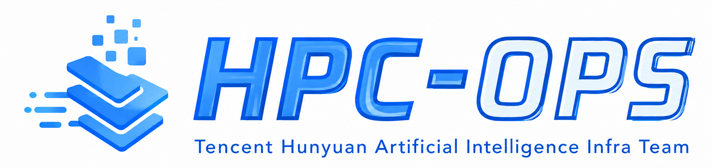

<div align="center">
  
  <h2 align="center">
    HPC-Ops
  </h2>
  <p>
    
    
    
    
  </p>
</div>

HPC-Ops is a **production-grade, high-performance, and easy-to-use** operator
library for LLM inference, developed by the Tencent Hunyuan AI Infra team.

It focuses on the hot paths that dominate real serving latency and throughput:
Attention, MoE, GEMM, sampling, normalization, and communication-compute fusion.
The kernels are designed for modern NVIDIA GPUs and benchmarked against widely
used inference frameworks and kernel libraries such as vLLM, SGLang,
FlashInfer, NCCL, cuBLAS, and TensorRT-LLM where applicable.

<p align="center">
  <a href="#why-hpc-ops">Why HPC-Ops?</a> |
  <a href="#updates">Updates</a> |
  <a href="#performance">Performance</a> |
  <a href="#operator-catalog">Operator Catalog</a> |
  <a href="#quick-start">Quick Start</a> |
  <a href="#roadmap">Roadmap</a>
</p>

## Why HPC-Ops?

- **SOTA Performance & Production-Proven**: Deeply optimized kernels tailored
  for NVIDIA H20 GPUs, delivering SOTA performance across Attention, GEMM, MoE,
  sampling, and fused communication-computation operators. Powering large-scale production
  inference in Tencent.
- **Easy to Integrate**: A clean Python API designed for seamless integration
  into popular inference frameworks like vLLM and SGLang, with tests and
  benchmarks that make validation straightforward.
- **Rich Precision Support**: Native support for multiple data types including
  BF16 and FP8 with different quantization schemes, plus mixed-precision kernels for accuracy-sensitive inference scenarios.
- **A Modern CUDA Tutorial**: Hands-on examples of building SOTA kernels with
  CUDA, CuTe, CUTLASS, cp.async, TMA, PDL, and multicast in compact production
  operator implementations.

## Updates

### June 2026

<details>
<summary><strong>Dynamic Decode Attention</strong>: Runtime task scheduling for mixed-length decode workloads.</summary>

Online decode attention has highly dynamic workloads: request lengths can vary
significantly across decode steps, and requests inside the same batch may have
very different KV-cache lengths. Static split-k scheduling cannot adapt to this
shape distribution, so long requests often create CTA-level tail latency while
shorter requests leave compute resources underutilized.

HPC-Ops introduces a dynamic task scheduling path that splits all requests into
uniform KV tiles, assigns tiles before each decode step, and balances them
across CTAs with a greedy bin-packing strategy. Attention kernels then consume
the generated task map directly, while a combine kernel merges split-k results.
This makes per-CTA work more even and reduces long-tail latency in both
long-context and mixed-length decode batches.

</details>

<details>
<summary><strong>Sparse Attention</strong>: FP8 block-sparse prefill attention for long-context workloads.</summary>

Long-context prefill attention is memory-bandwidth bound when most of the KV
cache is irrelevant to the current query. Block-sparse patterns let the kernel
skip entire KV tiles, but exploiting sparsity at FP8 precision requires careful
tile quantization and mask-aware scheduling to avoid accuracy loss and load
imbalance.

HPC-Ops provides an FP8 block-sparse prefill attention kernel that takes a
precomputed block mask, skips masked-out KV tiles entirely, and uses per-tile
FP8 scaling to preserve numerical quality across the sparse pattern.

</details>

<details>
<summary><strong>Route GEMM</strong>: BF16 x FP32 GEMM for precision-sensitive sparse compute.</summary>

Some inference GEMMs use BF16 activations but require FP32-sensitive weights,
for example MoE router GEMM and state-compress GEMM in sparse or linear
attention. Since modern Tensor Cores do not provide native FP32 Tensor Core
throughput, naive FP32 GEMM falls back to CUDA cores, while directly using BF16
or TF32 can introduce large accuracy degradation or extra conversion overhead.

HPC-Ops decomposes each FP32 weight into a high BF16 component and a low BF16
residual component with a fixed scale of `1 / 256`, then computes the result as
a fused linear combination of two BF16 Tensor Core GEMMs. The implementation
keeps both GEMMs inside one kernel, shares input movement, keeps intermediate
accumulators in registers, and writes the final result once, preserving
FP32-level accuracy with much higher throughput.

</details>

<details>
<summary><strong>Fused MoE</strong>: Low-latency FP8 MoE with per-tensor and block-wise scaling.</summary>

The FusedMoE path targets low-latency LLM MoE inference by fusing routing,
Gate-Up GEMM, activation quantization, Down GEMM, and top-k weighted reduction
into one pipelined execution path. Compared with gather-then-GEMM designs, the
Gate-Up GEMM reads original tokens directly through routing indices, removing
the standalone gather stage and its extra memory traffic.

Routing/index preprocessing reduces global atomic pressure with shared-memory
counting and contiguous expert output ranges. The cp.async GEMM path removes
Warp Specialization in the low-latency regime, increasing CTA residency and
shifting latency hiding from an intra-CTA software pipeline to cross-CTA
hardware scheduling. PDL then chains the stages to reduce kernel launch bubbles.

</details>

<details>
<summary><strong>Fused AllReduce + RMSNorm</strong>: Communication, residual add, and normalization fusion for tensor-parallel inference.</summary>

Tensor-parallel inference frequently runs AllReduce, residual add, and RMSNorm
as separate stages, even though they form one logical operation: normalize the
reduced activation plus residual. This creates extra kernel launches and
repeated HBM reads/writes around an already communication-heavy path.

HPC-Ops fuses AllReduce, Residual Add, and RMSNorm into NVLink-native kernels.
The high-throughput mode uses CUDA multicast for large-token prefill-like
shapes, while the low-latency mode uses a Lamport P2P two-kernel design with
PDL overlap for small-token decode shapes. Both modes use a two-shot
communication schedule to reduce communication overhead while keeping the
normalization fused into the collective path.

</details>

<details>
<summary><strong>Sampler</strong>: Fused decode post-processing for repetition penalty, temperature scaling, Top-K, Top-P, Softmax, and random sampling.</summary>

Decode-step sampling often chains many small kernels over the vocabulary
dimension, including repetition penalty, temperature scaling, top-k, top-p,
softmax, random sampling, and penalty-mask update. In small-batch serving,
these fragmented kernels and repeated global-memory passes can become a visible
latency bottleneck.

HPC-Ops provides a fused sampler that collapses the full sampling pipeline into
two CUDA kernels, with a lighter temperature-only fast path dispatched
automatically when applicable. It keeps the penalty mask update on GPU, uses
fine-grained parallelism across blocks for small batches, optimizes small top-k
cases with local heap/merge-style selection, and combines top-k reduction with
softmax statistics to reduce vocabulary reads and fixed launch overhead.

</details>

## Operator Catalog

| Area | Operator family | Primary scenario | Precision | Entry points |
|---|---|---|---|---|
| Attention | Prefill / decode attention, paged KV cache, dynamic decode scheduling | Online LLM serving with variable request lengths | BF16 / FP8 | `hpc/attention.py` |
| Attention | Block-sparse prefill attention | Long-context prefill with block-level sparse masks and paged KV cache | FP8 | `hpc/attention.py`, `hpc/stem.py` |
| GEMM | BF16 x FP32 GEMM | MoE router GEMM, sparse/linear attention state-compress GEMM | BF16 x FP32 | `hpc/gemm.py` |
| Grouped GEMM | FP8 grouped GEMM | Expert-parallel and grouped expert matmul | FP8 | `hpc/group_gemm.py` |
| Fused MoE | Fused FP8 MoE pipeline | Low-latency MoE inference under TP/EP shapes | FP8 | `hpc/fuse_moe.py` |
| Communication | Fused AllReduce + Residual + RMSNorm | Tensor-parallel post-GEMM fusion | BF16 | `hpc/allreduce.py` |
| Sampling | Fused sampler | Decode-step token sampling | BF16 / FP32 | `hpc/sampler.py` |
| Normalization / RoPE / activation | RMSNorm, RoPE + KV store, activation quantization | Common LLM layer utilities | BF16 / FP8 | `hpc/normalization.py`, `hpc/rope.py`, `hpc/act.py` |

## Performance

| Operator | Benchmark scope | Baselines | Representative result |
|---|---|---|---|
| Attention BF16 | Prefill, decode | FlashInfer, FA2, FA3, TensorRT-LLM | Up to 1.33x prefill, 2.22x decode |
| Attention FP8 | Prefill, decode | FlashInfer, FA3, TensorRT-LLM | Up to 1.12x prefill, 2.0x decode |
| Sparse Attention FP8 | Prefill, varying sparsity ratios and sequence lengths | MIT-BSA BF16, FlashPrefill-BSA BF16, HPC-Dense FP8, and FA3-Dense FP8 | Up to 3.16x |
| Dynamic decode attention | Variable KV-cache decode, long single-batch cases, mixed-length batch cases | Static split-k scheduling | Up to 2.88x |
| BF16 x FP32 GEMM | Router GEMM shapes, state-compress GEMM shapes | cuBLAS FP32, cuBLAS TF32 | Up to 3.22x |
| Fused FP8 MoE | DeepSeek-V3, Hunyuan-V3, Qwen3-235B under TP=8 EP=1, TP=1 EP=8 | vLLM CUTLASS, vLLM Triton, SGLang | Up to 1.6x TP, 1.5x EP |
| Fused AllReduce + Residual + RMSNorm | Single-node BF16 tensor-parallel shapes, hidden sizes 4096/5120/7168 | NCCL, FlashInfer | Up to 1.76x |
| Fused sampler | BF16 logits, vocab size 120832, batch size 1-512 | vLLM-style PyTorch, FlashInfer | Up to 8.5x |
| GroupGEMM FP8 | Expert grouped matmul, prefill, decode | DeepGEMM | Up to 1.1x prefill, 1.88x decode |

*Performance varies across cases; see `benchmark/` for reproduction.*


## Quick Start

### Requirements
- NVIDIA SM90 architecture GPU
- Python 3.8 or higher
- Compilers with C++17 support
- CUDA Toolkit: CUDA 12.8 or higher

*You can set up the environment by installing the modules listed in requirements-dev.txt.*

### Install from Source

```bash
git clone https://github.com/Tencent/hpc-ops.git
cd hpc-ops

# build packages
make wheel
python3 -m pip install dist/*.whl
```

### Basic Usage

Example: GroupGEMM fp8 kernel usage
```python
import torch
import hpc

num_tokens = 1024
num_group, n, k = 8, 4096, 4096
x = torch.randn((num_tokens, k), dtype=torch.float, device="cuda").to(torch.float8_e4m3fn)
w = torch.randn((num_group, n, k), dtype=torch.float, device="cuda").to(torch.float8_e4m3fn)
scale = torch.full((num_group,), 1.0, dtype=torch.float, device="cuda")
num_tokens_per_group = torch.full((num_group,), 8, dtype=torch.int32, device="cuda")
cu_num_tokens_per_group = torch.cumsum(torch.cat([torch.tensor([0], dtype=torch.int32, device="cuda"), num_tokens_per_group]), dim=0).to(torch.int32)

output = hpc.group_gemm_pertensor_fp8(
    x, w, num_tokens_per_group, cu_num_tokens_per_group, scale,
)
```

*For the usage of other operators, please refer to the corresponding test files in the tests/ directory.*

## Roadmap

- **Extended Quantization Support**: Flexible strategies (4bit/8bit mixed-precision included), kernel optimizations for quantized attention and GEMM that balance speed and accuracy.
- **Megakernel**: Fuse multiple consecutive operators into a single kernel to reduce inter-kernel launch overhead and intermediate memory traffic.
- **Next-Generation Hardware Support**: Extend HPC-Ops to more advanced GPU architectures.
- **Low-Precision Communication Kernels**: Add low-precision communication kernels, e.g. AllReduce and AllGather, for distributed inference.

Contributions are welcome! If you've found a kernel bug or built a faster operator, we'd love to see your PR.

⭐ **Star this repo** to follow our progress.
We're continuously improving performance to make your LLM inference faster and more efficient.
More improvements are on the way.
